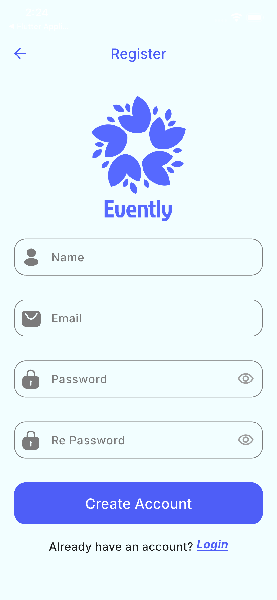
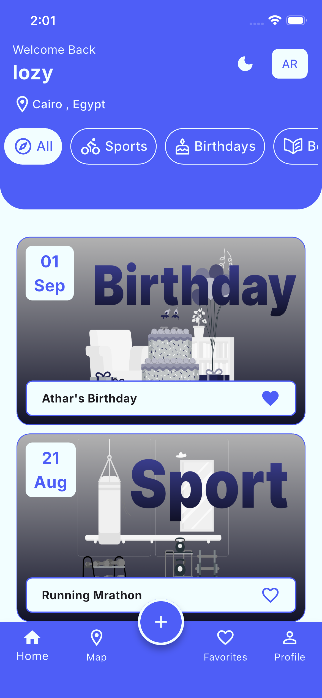
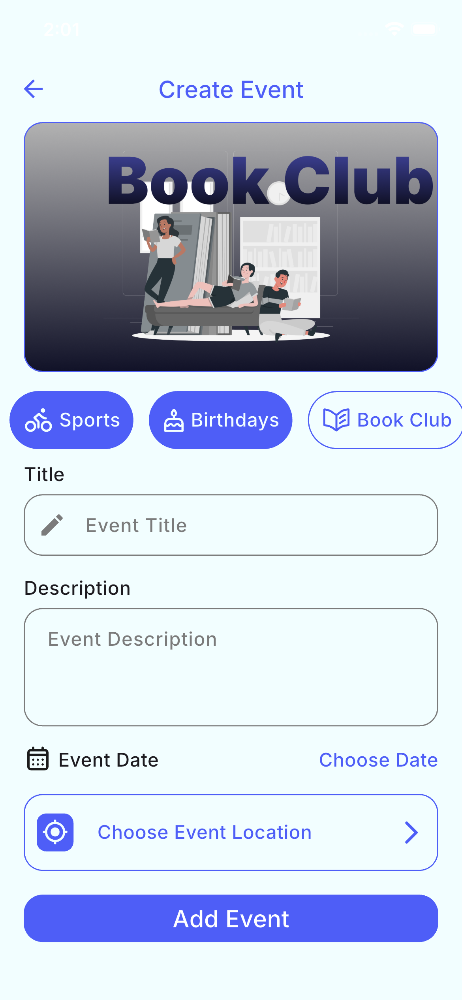
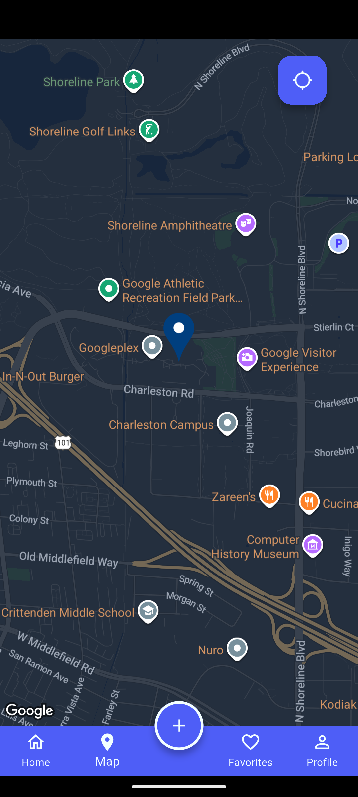
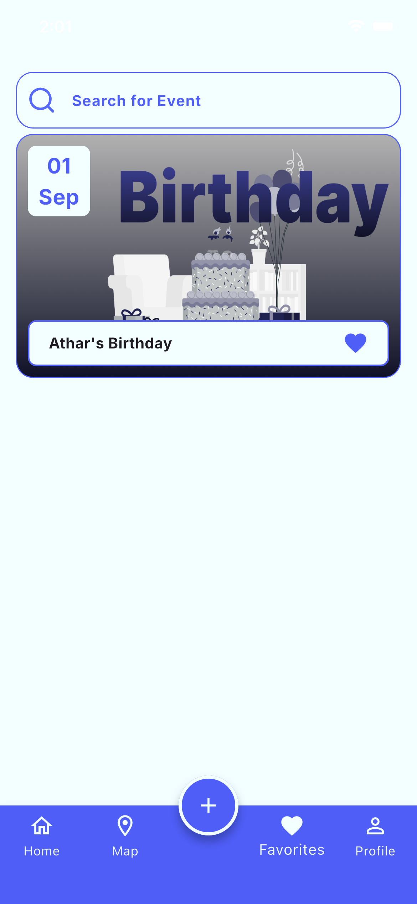
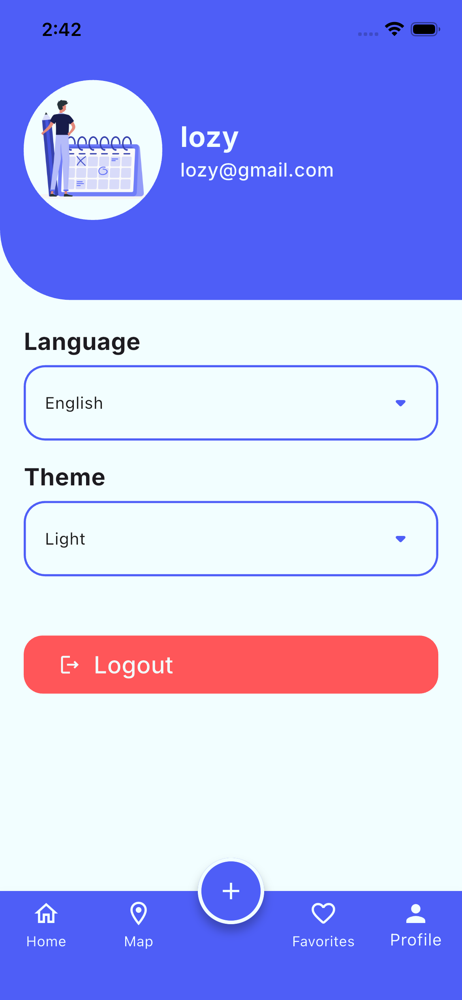

# Evently

Evently is a Flutter app for discovering, creating, and managing local events. Users can browse events by category, view them on a map, save favourites, and manage their own events — all backed by Firebase.

## Features

- 🔐 **Authentication** — email/password sign up & login, Google Sign-In, and password reset, powered by Firebase Auth
- 🗓️ **Event management** — create, edit, and view detailed event listings (title, description, category, image, date, location)
- 📍 **Location & maps** — pick an event location on Google Maps, geocode addresses, and view events near you using device location
- ⭐ **Favourites** — save events for quick access later
- 🏠 **Home feed** — browse events by category with a searchable home tab
- 👤 **Profile** — view and manage account info
- 🌗 **Light/dark theme** — user-toggleable app theme
- 🌍 **Localization** — English and Arabic support (RTL-ready)
- 👋 **Onboarding** — first-run walkthrough for new users

## 📸 Screenshots

<p align="center">
  
  
  
  
</p>

<p align="center">
  
  
  
</p>

## Tech Stack

- **Flutter / Dart**
- **Firebase** — Authentication & Cloud Firestore
- **Google Maps** — `google_maps_flutter`
- **Geolocator & Geocoding** — location services and address handling
- **Provider** — state management for theme and language settings
- **Google Sign-In**
- **Shared Preferences** — local persistence
- **Supporting packages**:
  - `flutter_easyloading`
  - `bot_toast`
  - `flutter_svg`
  - `smooth_page_indicator`
  - `animated_custom_dropdown`
  - `permission_handler`
  - `intl`

## Project Structure

```text
lib/
├── core/
│   ├── constants/       # App-wide constants (images, icons, storage keys)
│   ├── models/          # Data models (Event, User, Onboarding, Category)
│   ├── routes/          # Named routes & route generation
│   ├── services/        # Firebase, location, local storage, snackbar & loading services
│   ├── theme/           # App colors, text styles & theme manager
│   └── widgets/         # Shared/reusable widgets
├── extenstions/         # Dart extensions (validation, spacing, padding, context helpers)
├── l10n/                # Localization (English & Arabic)
├── modules/
│   ├── authentication/  # Login, register & forgot password
│   ├── event/           # Create, edit, view & locate events
│   ├── layouts/         # Main app shell: home, map, favourites & profile tabs
│   ├── onBoarding/      # Onboarding flow
│   └── splash/          # Splash screen
├── firebase_options.dart
└── main.dart
## Getting started

### Prerequisites

* [Flutter SDK](https://docs.flutter.dev/get-started/install) (stable channel)
* A [Firebase project](https://console.firebase.google.com/) with Authentication (Email/Password + Google) and Cloud Firestore enabled
* A Google Maps API key for Android and iOS

### Setup

1. **Clone the repo**

   ```bash
   git clone https://github.com/<your-username>/evently.git
   cd evently
   ```

2. **Install dependencies**

   ```bash
   flutter pub get
   ```

3. **Configure Firebase**

   * Install the [FlutterFire CLI](https://firebase.google.com/docs/flutter/setup) and run:

   ```bash
   flutterfire configure
   ```

   * This generates `lib/firebase_options.dart` and adds the platform config files (`google-services.json` for Android, `GoogleService-Info.plist` for iOS).

4. **Add your Google Maps API key**

   * Android: add your key to `android/app/src/main/AndroidManifest.xml`
   * iOS: add your key to `ios/Runner/AppDelegate.swift`

5. **Run the app**

   ```bash
   flutter run
   ```

## Localization

Translations live in `lib/l10n/*.arb`. After editing an `.arb` file, regenerate the localization classes with:

```bash
flutter gen-l10n
```

## Contributing

Contributions are welcome! Please open an issue to discuss any major changes before submitting a pull request.

## License

This project currently has no license specified. Add a `LICENSE` file to define how others may use this code.

```
```
